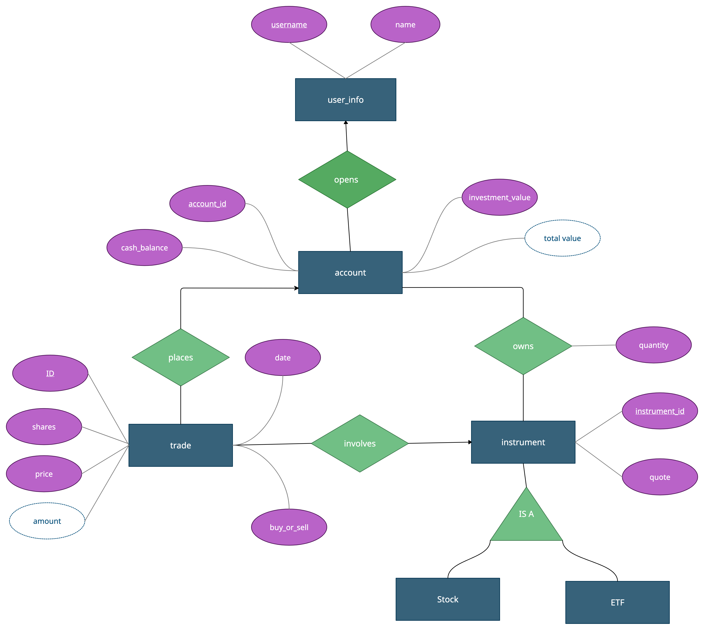

# STOCK TRADING DATABASE
### Conceptual Model
**The conceptual data model for this Trading Database features users, accounts, trades and instruments.**
- A user has a unique username and may have other attributes like name.
- An account has a unique number, cash balance, investment value and total value.
- A trade is uniquely identified by an id and can be either a buy transaction or a sell transaction. Other trade attribute types include a trade date, number of shares, price per share and total amount.

### Relationships
- While a user can open many accounts, each account must belong to exactly one user.
- Similarly, an account can place many trades and an instrument can participate in many trades, but a trade is always associated with only one account and one instrument.
- Finally, an account may have many positions and an instrument can be owned by many accounts.
- Each position in a particular account is described by an instrument id and quantity

## Entity-Relationship Diagram

## Schema Diagram

### Triggers
**The database contains three triggers. Namely upd_account, upd_owns and DEBT.**
- The upd_account trigger updates the cash_balance and investment_value attributes of the account table upon every new trade for that account_id. 
The total_value in accounts table is a derived attribute which is computed by adding cash_balance and investment_value attributes for a particular account.
- The upd_owns trigger updates or inserts account_id and instrument_id upon every trade to maintain a many-to-many relationship between account and instrument.
- The DEBT trigger inserts account_id inside the DEBT table when that account’s cash_balance becomes negative.
